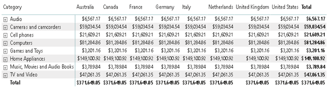

# Global-Electronics-Retailer-Data-Warehouse-Model

This repository explores the construction of a data warehouse using star, snowflake, and fact constellation schema models, along with performing OLAP operations on a provided electronics dataset [link to dataset].

## Project Objectives
- Design and implement dimensional data warehouse models (star, snowflake, and fact constellation) for the electronics dataset.
- Perform Online Analytical Processing (OLAP) operations such as drill-up, drill-down, slicing, and dicing.
- Create informative visualizations using Power BI and Python libraries like pandas and matplotlib.
- Generate a 3D graph to explore relationships between various dimensions.
- Gain insights into regional performance, category-wise trends, subcategory variations, country-level analysis, and the effectiveness of data manipulation techniques.

## Steps Involved
### Data Preparation:
- Load the electronics dataset.
= Construct star, snowflake, and fact constellation schema models.
### OLAP Operations:
- Implement drill-up and drill-down functionalities using a continent hierarchy (continent, country, state, city).
= Create a matrix table to facilitate drill-up/down operations.
- Include slicers for category and country for interactive exploration.
- Perform slicing and dicing operations on charts.
### Visualization in Power BI:
- Generate a pie chart to visualize unit cost by category.
- Construct an area chart to depict unit cost by subcategory.
- Create a pivot table summarizing unit cost, category, subcategory, and country.
### Python Scripting for Visualization:
- Replicate the pivot table creation using a Python script with pandas.
- Implement slicing and dicing functionalities using Python libraries.
- Integrate slicers for manipulating visualizations.
### 3D Graph Visualization:
- Build a 3D graph using unit cost, category, subcategory, and country dimensions with matplotlib.

## Screenshots of Models

### Data Warehouse Model

**Star Schema:**

**Snow Flake:**

**Fact Constellations:**

### OLAP Operations

**Drill Up and Drill Down:**

**Slicing:**

**Pivot:**

**Dicing:**

**3D Graph:**

## Key Inferences from Data Warehouse Exploration
The data warehouse exploration with OLAP and visualization techniques yielded valuable insights into the electronics dataset. Here's a summary of the key inferences gained:

### Regional Performance Analysis: 
- OLAP drill-down capabilities allow us to analyze sales performance from continent down to city level. This helps identify high or low performing regions, enabling targeted marketing and operational adjustments.

### Category-wise Cost Distribution: 
- The pie chart visualizing unit cost by category provides a clear picture of cost distribution across different product categories. This helps understand which categories contribute most significantly to the overall cost structure.

### Subcategory Trends: 
- The area chart showcasing unit cost by subcategory allows for identifying trends and patterns within each category. This helps pinpoint specific subcategories driving costs or experiencing significant fluctuations.

### Country-level Cost Variations: 
- By including the country dimension in the analysis, we can observe variations in unit costs across different countries. This information is valuable for optimizing pricing strategies based on local market conditions and currency fluctuations.

### Effectiveness of Slicing and Dicing: 
- Slicing and dicing operations on charts provide a flexible way to explore data from different angles. Users can dynamically filter and drill down into specific data subsets, facilitating deeper analysis and informed decision-making.

### Insights from 3D Visualization: 
- The 3D graph incorporating multiple dimensions offers a visually rich representation of the data. This enables the exploration of complex relationships between variables like category, subcategory, and country, potentially uncovering hidden insights or correlations.

## Let's Connect!

🌐 LinkedIn: https://www.linkedin.com/in/subramanian-s-ab94302a1/ 
📧 Email: subramanian160104@gmail.com
